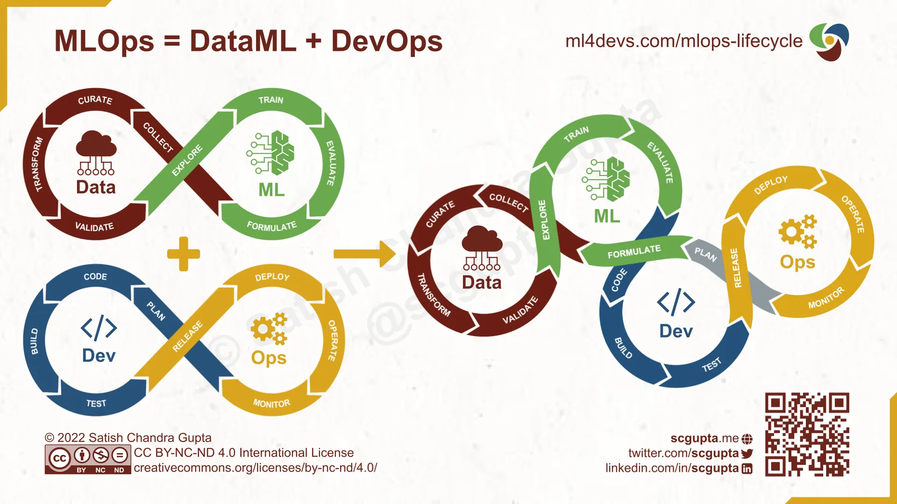

# Отчетный проект за второй модуль

# Что нужно сделать

Необходимо создать открытый репозиторий (github, gitlab, etc.), в нём создать
пакет на Python, который будет являться валидным с точки зрения пакетирования и
решать какую-либо задачу машинного обучения.

Под "решать" понимается дву вещи:

- есть файл train.py, в котором данные загружаются, модель тренируется, пишутся
  метрики и сохраняется на диск
- есть файл infer.py, который считывает с диска модель из предыдущего пункта,
  загружает тестовый датасет, предсказывает моделью ответы для этих данных,
  записывает ответы на диск в .csv файл.

# Задача машинного обучения

> Была взята задача бинарной классификация достоверности новостей Данные
> получили из сооревнований Kaggle https://www.kaggle.com/c/fake-news/

# Как начать работать

- Склонировать репозиторий
- Создать виртуальное окружение
- Установить зависимости: poetry install
- > pre-commit install
- > pre-commit run -a
- > python train.py
- > python infer.py

# Какие инструменты необходимо использовать:

1. Poetry Зависимости должны быть представлены в pyproject.toml, также не
   забудьте добавить poetry.lock файл.

2. Pre-commit Необходимо использовать хуки black, isort, flake8 (остальные тоже
   стоит применить, но это опционально). Также необходимо, чтобы запуск
   pre-commit run -a выдавал зелёный результат.

3. DVC Для dvc в качестве бекенда проще и доступнее всего использовать гугл диск
   (проверьте, что папка доступна по ссылке на чтение всем, иначе мы не сможем
   проверить), можно использовать и любой другой бекенд, но тут возникает такой
   же вопрос с доступностью. Скачивание данных с помощью dvc необходимо встроить
   в имеющиеся команды train и infer, для этого у dvc есть python api (на
   крайний случай можно вызывать CLI).

4. Hydra Переведите основные гиперпараметры препроцессинга, обучения и
   постпроцессинга в yaml конфиги hydra. Сами конфиги лучше всего расположить в
   папке configs в корне репозитория.

5. Logging Необходимо добавить логирование ваших основных метрик и функций
   потерь (всего не менее 3 графиков). Также в эксперимент записывать
   использованные гиперпараметры и версию кода (git commit id). Считайте, что
   сервер mlflow уже поднят на порту 128.0.1.1:8080, а tensorboard на
   128.0.1.2:8080, его адрес можно добавить в поле конфига.
